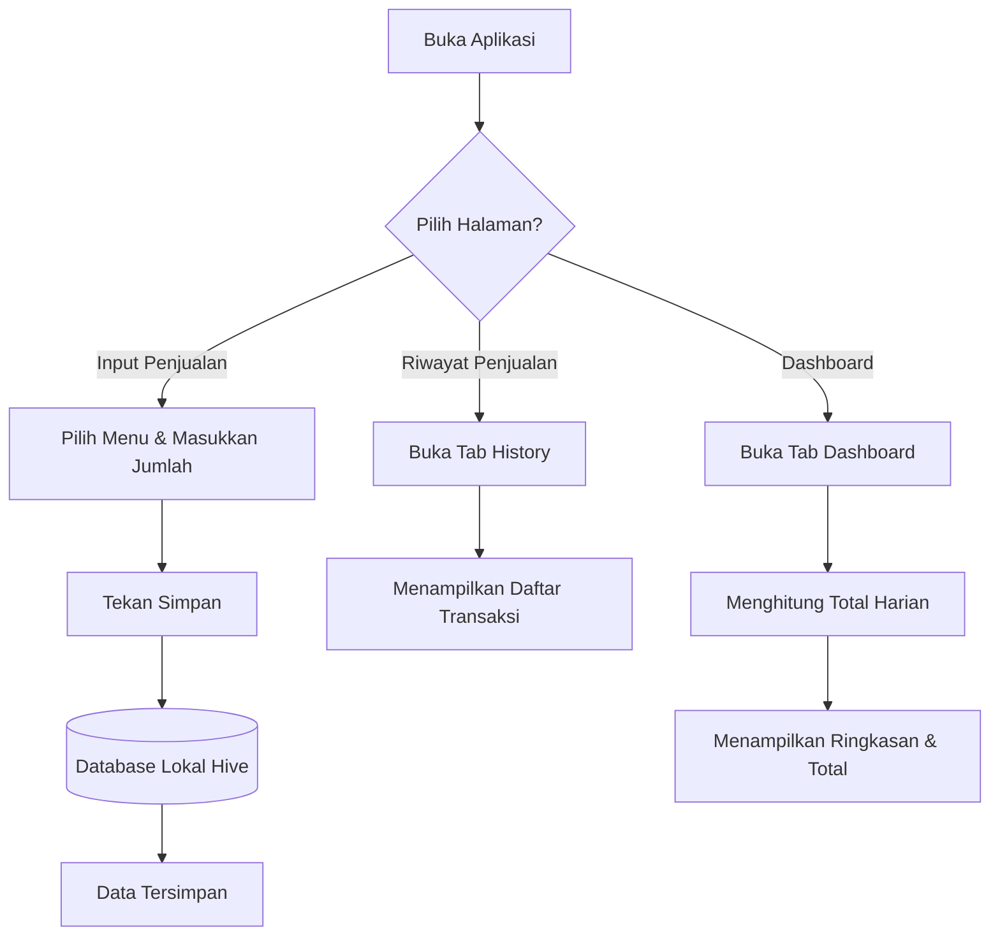

# AmagiTrack - Pencatatan Penjualan UMKM


AmagiTrack adalah aplikasi mobile pencatatan penjualan offline berbasis Android (Flutter/Dart) yang didesain khusus untuk menggantikan pencatatan manual di UMKM Amagi Street Coffee. Aplikasi ini dikembangkan sebagai solusi atas kendala pencatatan manual seperti proses yang lambat saat jam ramai, risiko data hilang, serta kesulitan rekapitulasi total penjualan harian.

## Daftar Isi

- [Team Contributions](#team-contributions)
- [Target Pengguna](#target-pengguna)
- [Batasan Sistem](#batasan-sistem)
- [Fitur Utama](#fitur-utama)
- [Kebutuhan Sistem](#kebutuhan-sistem)
- [Alur Pengguna](#alur-pengguna)
- [Tech Stack](#tech-stack)
- [Struktur Proyek](#struktur-proyek)
- [Installasi](#installasi)
- [Penggunaan](#penggunaan)
- [Pembelajaran Utama](#pembelajaran-utama)

## Team Contributions

| Role | Members |
|---|---|
| UI/UX Design | **Ilham Ramadhani**: Merancang alur pengguna (User Flow) dan wireframe.<br><br>**Fatwa Ikhwan Maulaya**: Membuat desain high-fidelity, menentukan palet warna, tipografi, dan aset ikon aplikasi. |
| Flutter Development | **Muhammad Zaky Vierrzady**: Slicing UI halaman Input Penjualan.<br><br>**Alil Akbar**: Slicing UI halaman Riwayat dan Dashboard.<br><br>**Muh Bintang Novariansah Putra**: Integrasi database dan logika perhitungan total pendapatan harian. |
| Database Integration | **Angga Maulana Saputra**: Inisialisasi database Hive, model data Sales, dan fungsi simpan/panggil data. |
| Testing & QA | **Muhammad Nabil Syafiq**: Pengujian aplikasi pada emulator dan perangkat fisik serta pencatatan bug. |
| Documentation | **Jerremy Christian Thio**: Pengaturan milestone dan koordinasi dengan pihak UMKM.<br><br>**Haidar Halim**: Penyusunan PRD, laporan UTS/UAS, dan dokumentasi lapangan. |

## Target Pengguna

- Pemilik UMKM coffeeshop kecil
- Kasir atau barista
- Karyawan operasional toko

## Batasan Sistem

- Tidak mendukung pembayaran digital (e-wallet/QRIS)
- Tidak menggunakan sistem login pengguna
- Tidak memiliki sinkronisasi cloud atau online
- Tidak ada manajemen stok bahan otomatis
- Tidak ada fitur printer struk

## Fitur Utama

- **Input Penjualan**  
  Kasir dapat memilih menu, memasukkan jumlah item, dan menyimpan transaksi ke database lokal dalam waktu kurang dari 1 detik.

- **Riwayat Penjualan**  
  Menampilkan daftar transaksi berdasarkan waktu lengkap dengan nama menu, jumlah item, serta waktu transaksi.

- **Dashboard Total Penjualan Harian**  
  Menampilkan rekapitulasi otomatis total pendapatan harian untuk membantu evaluasi performa penjualan.

## Kebutuhan Sistem

### Kebutuhan Fungsional

- User dapat menambahkan data penjualan baru.
- Sistem menyimpan data ke database lokal secara persisten.
- User dapat melihat riwayat penjualan berdasarkan waktu.
- Sistem mencatat tanggal dan waktu transaksi otomatis.
- Sistem menghitung total pendapatan harian otomatis.

### Kebutuhan Non-Fungsional

- Aplikasi berjalan sepenuhnya offline.
- Waktu respon penyimpanan kurang dari 1 detik.
- Antarmuka sederhana dan mudah digunakan.
- Penanganan error mencegah aplikasi crash saat input tidak valid.

## Alur Pengguna



## Tech Stack

- Dart / Flutter
- Hive Local Database
- Figma
- Flutter Build APK

## Struktur Proyek

```text
lib/
├── models/     # Struktur data dan adapter Hive
├── utils/      # Helper dan utilitas aplikasi
├── views/      # Dashboard, History, dan Input Penjualan
└── main.dart   # Entry point aplikasi
```

## Installasi

1. Pastikan Flutter SDK telah terinstal.
2. Clone repository:

```bash
git clone https://github.com/hamsigma/amagitrack.git
```

3. Install dependencies:

```bash
flutter pub get
```

4. Sambungkan emulator atau perangkat Android.
5. Jalankan aplikasi:

```bash
flutter run
```

6. Build APK production:

```bash
flutter build apk --release
```

## Penggunaan

1. Buka halaman Input Penjualan.
2. Pilih menu dan masukkan jumlah item.
3. Tekan tombol simpan untuk menyimpan transaksi.
4. Buka halaman Riwayat untuk melihat transaksi.
5. Buka Dashboard untuk melihat total penjualan harian.

## Pembelajaran Utama

- Implementasi database offline menggunakan Hive untuk performa cepat tanpa internet.
- Pengelolaan user flow dan edge cases agar aplikasi tetap stabil.
- Kolaborasi tim terstruktur dengan pembagian tugas yang jelas.
- Pengembangan solusi digital berbasis permasalahan nyata UMKM.
