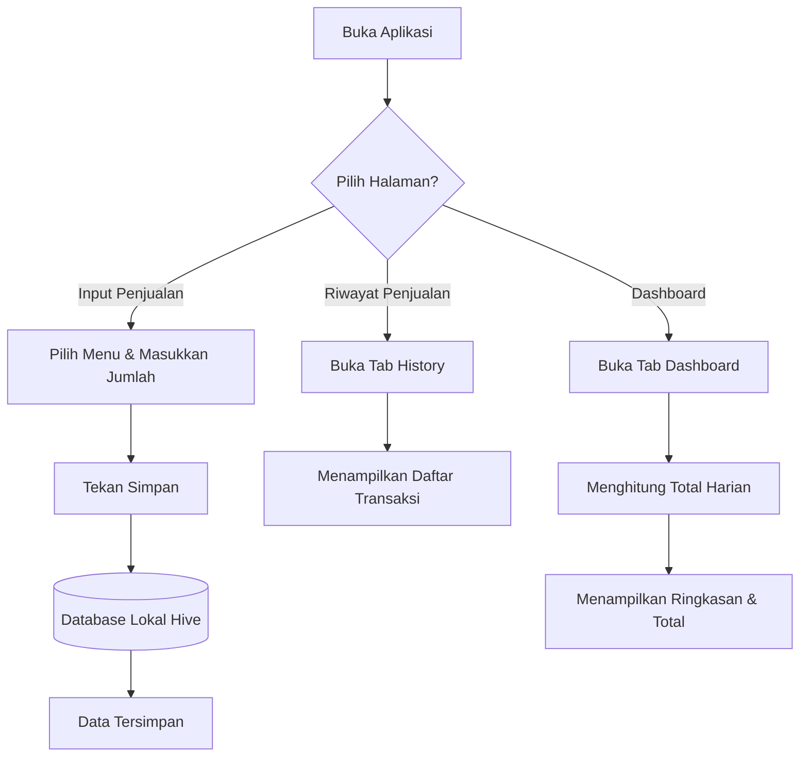

# AmagiTrack - Pencatatan Penjualan UMKM

  

AmagiTrack adalah aplikasi mobile pencatatan penjualan offline berbasis Android (Flutter/Dart) yang didesain khusus untuk menggantikan pencatatan manual di UMKM Amagi Street Coffee. Aplikasi ini dikembangkan sebagai solusi atas kendala pencatatan manual seperti proses yang lambat saat jam ramai, risiko data hilang, serta kesulitan rekapitulasi total penjualan harian.

## Daftar Isi

- [Team Contributions](#team-contributions)
- [Target Pengguna](#target-pengguna)
- [Batasan Sistem](#batasan-sistem)
- [Fitur Utama](#fitur-utama)
- [Kebutuhan Sistem](#kebutuhan-sistem)
- [Alur Pengguna](#alur-pengguna)
- [Tech Stack](#tech-stack)
- [Struktur Proyek](#struktur-proyek)
- [Panduan Installasi & Penggunaan](#panduan-installasi--penggunaan)
- [Pembelajaran Utama](#pembelajaran-utama)

---

## Team Contributions

| Role                 | Members                                                                                                                                                                                                                                                                                                                                           |
| -------------------- | ------------------------------------------------------------------------------------------------------------------------------------------------------------------------------------------------------------------------------------------------------------------------------------------------------------------------------------------------- |
| UI/UX Design         | **Ilham Ramadhani**: Merancang alur pengguna (User Flow) dan kerangka desain awal (Wireframe).<br><br>**Fatwa Ikhwan Maulaya**: Membuat desain High-Fidelity, menentukan palet warna, tipografi, serta aset ikon aplikasi.                                                                                                                        |
| Flutter Development  | **Muhammad Zaky Vierrzady**: Melakukan slicing UI khusus untuk halaman Input Penjualan.<br><br>**Alil Akbar**: Melakukan slicing UI untuk halaman Riwayat Transaksi dan Dashboard Total Penjualan.<br><br>**Muh Bintang Novariansah Putra**: Menghubungkan UI dengan database serta mengurus logika perhitungan otomatis total pendapatan harian. |
| Database Integration | **Angga Maulana Saputra**: Menginisialisasi database lokal (Hive), membuat model data Sales, dan fungsi simpan-panggil data.                                                                                                                                                                                                                      |
| Testing & QA         | **Muhammad Nabil Syafiq**: Melakukan pengujian fitur aplikasi di emulator/perangkat fisik dan mendata jika ada bug.                                                                                                                                                                                                                               |
| Documentation        | **Jerremy Christian Thio**: Bertanggung jawab mengatur jadwal kerja (milestone) dan koordinasi utama dengan pihak UMKM.<br><br>**Haidar Halim**: Menyusun dokumen PRD, laporan progres UTS, laporan akhir UAS, serta mengelola dokumentasi lapangan.                                                                                              |

---

## Target Pengguna

- Pemilik UMKM coffeeshop kecil
- Kasir atau barista
- Karyawan operasional toko

---

## Batasan Sistem

- Tidak mendukung pembayaran digital (e-wallet/QRIS)
- Tidak menggunakan sistem login pengguna
- Tidak memiliki sinkronisasi cloud atau online
- Tidak ada manajemen stok bahan otomatis
- Tidak ada fitur printer struk

---

## Fitur Utama

- Input Penjualan: Layar antarmuka bagi kasir untuk memasukkan transaksi baru. Pengguna dapat memilih menu minuman/makanan dari dropdown, memasukkan jumlah item yang terjual, dan menyimpan datanya secara langsung ke dalam sistem dalam waktu kurang dari 1 detik.
- Riwayat Penjualan: Halaman yang menampilkan daftar urut berdasarkan waktu dari semua transaksi yang telah tersimpan. Data mencakup informasi nama menu yang terjual, jumlah, serta tanggal dan jam transaksi.
- Dashboard (Total Penjualan Harian): Fitur rekapitulasi otomatis yang menampilkan total pendapatan harian, membantu pemilik usaha mengevaluasi performa tanpa menghitung manual.

---

## Kebutuhan Sistem

### Kebutuhan Fungsional

- User dapat menambahkan data penjualan baru.
- Sistem menyimpan data ke database lokal secara persisten.
- User dapat melihat riwayat penjualan yang diurutkan berdasarkan waktu.
- Sistem menampilkan data riwayat dalam bentuk daftar.
- Sistem mencatat tanggal dan waktu transaksi secara otomatis.
- Sistem menghitung total pendapatan penjualan harian secara otomatis.

### Kebutuhan Non-Fungsional

- Aplikasi dapat beroperasi sepenuhnya secara offline tanpa koneksi internet.
- Waktu respon simpan data sangat cepat (kurang dari 1 detik).
- Tampilan antarmuka sederhana dan mudah dipahami oleh pengguna.
- Aplikasi stabil dan memiliki penanganan error yang baik (tidak crash saat input kosong atau salah ketik).

---

## Alur Pengguna



---

## Tech Stack

- Bahasa / Framework: Dart / Flutter
- Database: Hive (Database Lokal)
- Tools Desain: Figma
- Build Tools: Flutter Build APK

---

## Struktur Proyek

Aplikasi ini menggunakan pendekatan pemisahan komponen agar kode mudah dibaca dan dikembangkan:

```text
lib/
├── models/     # Struktur data (SaleModel) dan file adapter Hive
├── utils/      # Fungsi utilitas tambahan (helper) untuk aplikasi
├── views/      # Kumpulan halaman antarmuka (Dashboard, History, Sales Input)
└── main.dart   # Titik mula (entry point) aplikasi dijalankan
```

---

## Panduan Installasi & Penggunaan

### Installasi

1. Pastikan Flutter SDK telah terinstal di perangkat komputer Anda.
2. Clone repository proyek ini ke dalam direktori lokal:
   ```bash
   git clone <url-repo-anda>
   ```
3. Buka terminal pada folder root proyek dan unduh semua dependencies:
   ```bash
   flutter pub get
   ```
4. Sambungkan emulator atau perangkat Android fisik.
5. Jalankan aplikasi:
   ```bash
   flutter run
   ```
6. Untuk melakukan build menjadi file APK untuk produksi:
   ```bash
   flutter build apk --release
   ```

### Penggunaan

1. Memasukkan Data: Buka halaman Input Penjualan, pilih menu dari daftar, masukkan jumlah item, lalu tekan tombol simpan. Data akan otomatis masuk ke database lokal.
2. Melihat Riwayat: Buka halaman Riwayat Penjualan untuk melihat seluruh transaksi yang telah diinputkan beserta detail waktunya.
3. Mengecek Total Penjualan: Buka halaman Dashboard untuk melihat ringkasan performa dan total penjualan pada hari tersebut.

---

## Pembelajaran Utama

- Implementasi Database Offline: Memahami cara kerja Hive sebagai database lokal di Flutter untuk mencapai performa yang sangat cepat (menyimpan data kurang dari 1 detik) tanpa bergantung pada koneksi internet.
- Pemahaman User Flow & Edge Cases: Mengelola alur pengguna secara logis serta penanganan error saat input kosong, input non-angka, atau saat database masih kosong, guna mencegah aplikasi mengalami crash.
- Kolaborasi Tim Terstruktur: Bekerja dalam tim berjumlah 9 orang dengan pembagian tugas yang jelas (desain, slicing UI, database, pengujian, laporan) untuk menghasilkan aplikasi yang stabil dan fungsional dari tahap inisialisasi hingga build APK.
- Pengembangan Solusi Berbasis Masalah Nyata: Mengubah masalah operasional UMKM dunia nyata (pencatatan manual di buku) menjadi solusi perangkat lunak digital yang efisien dan tepat sasaran.
